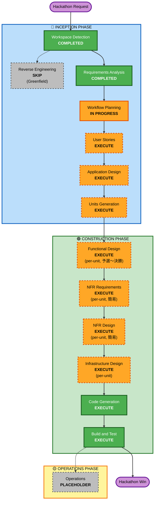

# Execution Plan — マカセル

> **AI-DLC Inception Phase / Workflow Planning 成果物**
>
> **作成日**: 2026-05-08
> **対象**: AWS AI-DLC ハッカソン 2026 提案「マカセル」
> **入力**: [`requirements.md`](../requirements/requirements.md) v3

---

## 1. Detailed Analysis Summary

### 1.1 Project Profile

| 項目 | 内容 |
|---|---|
| Project Type | Greenfield |
| Request Type | New Project |
| Scope | Cross-system（AI / フロント / バックエンド / 外部 API 連携 / 音声） |
| Complexity | Moderate |
| Depth Level | Standard |

### 1.2 Change Impact Assessment

| Impact Area | 該当 | 説明 |
|---|---|---|
| User-facing changes | Yes | Greenfield、UI / UX をゼロから設計 |
| Structural changes | Yes | サーバレス + AI Agent のシステム構成 |
| Data model changes | Yes | DynamoDB の単一テーブル設計を新規作成 |
| API changes | Yes | フロント↔バックエンド、外部 API（Google / Bedrock）の契約を新規定義 |
| NFR impact | Yes | デモ映え（最優先） / 東京リージョン / コスト軽量 |

### 1.3 Risk Assessment

| 項目 | 評価 | 理由 |
|---|---|---|
| Risk Level | **Medium** | 複雑度は中、ただし時間制約（5/10 締切まで 2 日、5/30 予選）がタイト |
| Rollback Complexity | **Easy** | Greenfield のためロールバック対象なし、要件変更にも柔軟 |
| Testing Complexity | **Moderate** | 音声入力 + Bedrock + Google API の組合せ、LLM の確率的出力 |

### 1.4 Critical Path

書類審査（5/15）通過に向けた必須提出物を特定:

```
[Requirements] ─┬─→ [User Stories]    ─┐
                ├─→ [Application Design] ─┼─→ [Units Generation] → 書類審査提出
                └─────────────────────────┘
```

すべて **5/10 までに完了させる必要がある**。

---

## 2. Workflow Visualization



---

## 3. Phases to Execute

### 🔵 INCEPTION PHASE

- [x] **Workspace Detection** — COMPLETED
- [x] **Reverse Engineering** — SKIP（Greenfield のため）
- [x] **Requirements Analysis** — COMPLETED
  - 成果物: [requirements.md](../requirements/requirements.md) v3
- [ ] **Workflow Planning** — IN PROGRESS（本ドキュメント）
- [ ] **User Stories** — **EXECUTE**
  - **Rationale**: 書類審査の必須提出物の 1 つ。マジメ・完璧主義タイプペルソナの旅路（導入期 → 拡大期 → 依存期 → 無能化）をストーリーに展開する
  - **Depth**: ライト（レビュー v2 で「ペルソナ深掘りしない」方針のため、INVEST を満たす最小限のストーリー数で）
  - **成果物**: `aidlc-docs/inception/user-stories/stories.md`, `personas.md`
- [ ] **Application Design** — **EXECUTE**
  - **Rationale**: 書類審査の必須提出物。八木案ベースのアーキテクチャを描き、AWS サービス選定（AgentCore / Bedrock モデル / 音声入力 STT / Google API）を確定させる必要がある
  - **Depth**: Standard（C4 のコンテキスト・コンテナレベル + AWS 構成図）
  - **成果物**: `aidlc-docs/inception/application-design/architecture.md`
- [ ] **Units Generation** — **EXECUTE**
  - **Rationale**: 書類審査の必須提出物「Unit of Work 計画」。段階 1〜2 の機能を Unit に分解し、依存関係・MVP/決勝境界・受け入れ基準を明示する
  - **Depth**: Standard（各 Unit の Intent / 受け入れ基準 / 依存 / 工数見積）
  - **成果物**: `aidlc-docs/inception/units/units.md`

### 🟢 CONSTRUCTION PHASE

- [ ] **Functional Design** (per-unit) — **EXECUTE**
  - **Rationale**: 各 Unit の業務ロジック詳細設計。予選 5/30 までに段階 1〜2 の Unit について実施
  - **Depth**: Standard
- [ ] **NFR Requirements** (per-unit) — **EXECUTE（簡易）**
  - **Rationale**: 主要品質目標は「デモ映え」一本だが、各 Unit のコスト・レイテンシ目安は明示する
  - **Depth**: Light（数値目標は最小限）
- [ ] **NFR Design** (per-unit) — **EXECUTE（簡易）**
  - **Rationale**: 観測性・エラーハンドリング等の最低限の設計
  - **Depth**: Light
- [ ] **Infrastructure Design** (per-unit) — **EXECUTE**
  - **Rationale**: ap-northeast-1 / DynamoDB / Bedrock / API Gateway / Lambda 等の構成詳細を Unit ごとに落とし込む
  - **Depth**: Standard
- [ ] **Code Generation** — **EXECUTE（ALWAYS）**
  - 予選向けに段階 1〜2、決勝向けに段階 3 を順次生成
- [ ] **Build and Test** — **EXECUTE（ALWAYS）**
  - 予選 / 決勝当日のデモ実演に向けた検証

### 🟡 OPERATIONS PHASE

- [ ] **Operations** — PLACEHOLDER
  - **Rationale**: ハッカソンスコープ外。決勝後の PMF 検証フェーズで再評価

---

## 4. Stages to Skip

- ❌ **Reverse Engineering** — Greenfield プロジェクトのためスキップ
- ❌ **Optional 成果物**（リスク分析 / 観測性設計 / 倫理スタンス宣言）— Q-F2 で「やらない、必須成果物のみ」と回答済み

---

## 5. Hackathon Timeline & Critical Path

### 5.1 マスタータイムライン

| 期日 | マイルストーン | 必要成果物 |
|---|---|---|
| **2026-05-09** | Inception 仕上げ + 応募文（800 字）ドラフト | User Stories / Application Design / Units Generation を完成 |
| **2026-05-10** | **応募締切 / Inception フェーズ完了** | aidlc-docs/ 一式が揃った状態 + Git Public 公開 |
| 2026-05-12 正午 | 運営宛メール（リポジトリ URL） | リポジトリのみ |
| 2026-05-15 | 書類審査結果 | （提出後の待機） |
| 2026-05-30 | 予選会＠麻布台ヒルズ | 段階 1〜2 の MVP デモ + プレゼン |
| 2026-06-25-26 | 決勝＠AWS Summit Japan | 段階 1〜3 の完全体 + AWS 上の動作デモ |

### 5.2 5/8〜5/10 のクリティカルパス

```
2026-05-08（今日）夕方
  ├─ ✅ Workspace Detection
  ├─ ✅ Requirements Analysis (v3 確定)
  └─ ✅ Workflow Planning（本ドキュメント） ← NOW

2026-05-09 午前
  ├─ User Stories (stories.md / personas.md)
  └─ Application Design (architecture.md)

2026-05-09 午後
  ├─ Units Generation (units.md)
  └─ 応募文ドラフト (800 字)

2026-05-10 午前
  ├─ 応募文最終化
  ├─ Git リポジトリ Public 化
  └─ 応募フォーム送信
```

> **着手から書類審査提出までの実働時間 = 約 1.5 日**。
> 各成果物は Standard〜Light 深さで、品質より完備性を優先する。

### 5.3 5/10〜5/30 の予選向け Construction

- 5/10〜5/15: 体制確定（チームメンバー間のロール分担）+ AWS 環境構築 + Google OAuth 申請
- 5/15〜5/25: 段階 1〜2 の Unit 単位で Functional Design → Code Generation → Build/Test
- 5/25〜5/29: MVP デモシナリオの完成、リハーサル
- 5/30: 予選会

### 5.4 5/30〜6/26 の決勝向け Construction

- 5/30 直後: 予選フィードバックを反映
- 6 月: 段階 3（自律実行モード / 30 日後ストーリー演出）の追加実装
- 6/15〜6/24: 決勝デモのリハーサル
- 6/25-26: AWS Summit Japan Day1 で会場作業 → Day2 決勝

---

## 6. Estimated Timeline

- **Total Phases to Execute**: 11（Inception 3 件 + Construction 6 件 + 横断 2 件）
- **Inception 完了見込み**: 2026-05-09 終日 〜 2026-05-10 午前
- **MVP（予選デモ）完成見込み**: 2026-05-29
- **決勝デモ完成見込み**: 2026-06-25

---

## 7. Success Criteria

### 7.1 Primary Goal

**ハッカソン決勝優勝（2026-06-26）**

### 7.2 Key Deliverables（書類審査向け）

- [x] `aidlc-docs/aidlc-state.md`（Inception 完了マーク）
- [x] `aidlc-docs/inception/requirements/requirements.md`
- [ ] `aidlc-docs/inception/user-stories/stories.md`, `personas.md`
- [ ] `aidlc-docs/inception/application-design/architecture.md`
- [ ] `aidlc-docs/inception/units/units.md`
- [x] `aidlc-docs/inception/plans/execution-plan.md`（本ドキュメント）
- [x] `aidlc-docs/audit.md`

### 7.3 Quality Gates

| ゲート | 判定基準 |
|---|---|
| 書類審査通過（5/15） | Inception 成果物が運営の前提条件を満たす |
| 予選通過（5/30） | 段階 1〜2 の MVP が 3 分デモで動作 + 「人をダメにする」が 15 秒で伝わる |
| 決勝優勝（6/26） | 段階 3 演出 + AWS 上で動作する完全版 + 会場ウケ |

### 7.4 NSM（プロダクト側、TBD）

プロダクト輪郭が確定し次第設定。候補: 「N 日連続でアプリを開かなかった日数」

---

## 8. Open Risks（Workflow 観点）

| リスク | 影響 | 緩和策 |
|---|---|---|
| 5/10 までに User Stories / Application Design / Units Generation の 3 件を仕上げきれない | 高 | 各成果物を Standard〜Light 深さに留める。完璧を狙わず、書類審査通過に必要な最低ラインで提出 |
| ペルソナを深掘りしないため User Stories の品質が薄くなる | 中 | INVEST を満たす最小限のストーリー数（5〜8 件）に絞り、密度を上げる |
| プロダクト名・コピーがまだ揺れる可能性 | 低 | 応募文作成時（5/9 午後）に最終確定 |
| チーム体制未確定で実作業の分担ができない | 中 | 5/10 までは Solo 進行、5/10〜5/15 で体制確定 |
| Google OAuth 申請の遅延で予選デモが組めない | 中 | 5/10 中に申請開始、内部テストモードで MVP を組む |

---

## 9. 推奨される次のステップ

```
1. Workflow Planning 承認（このドキュメント）
   ↓
2. User Stories 実行（stories.md / personas.md）
   ↓
3. Application Design 実行（architecture.md）
   ↓
4. Units Generation 実行（units.md）
   ↓
5. 5/10: 応募文を書き、Git 公開、応募フォーム送信
   ↓
6. 書類審査結果を待ちつつ Construction フェーズへ
```
